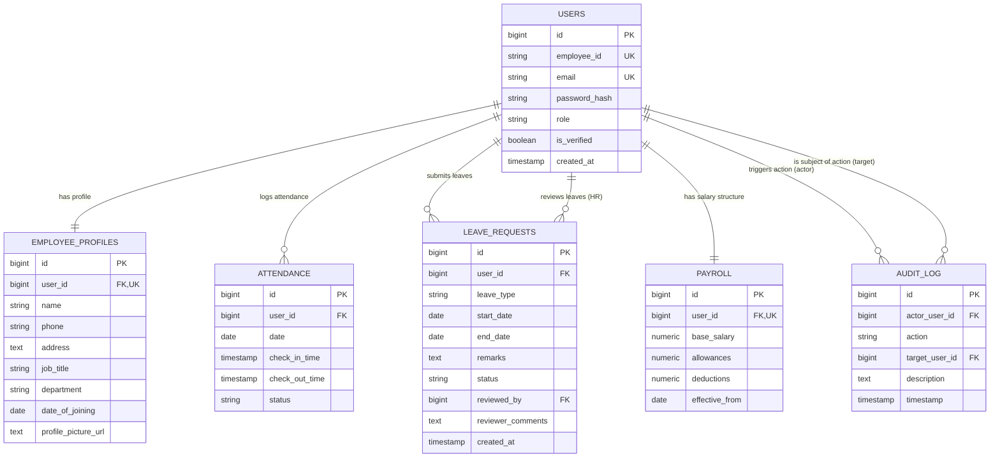

# Dayflow HRMS — Entity Relationship Diagram (ERD)

This document describes the database schema, relational structure, and integrity constraints powering **Dayflow HRMS**.

## Mermaid ER Diagram

## Relational Summary & Constraints

1. **`users` -> `employee_profiles` (1 : 1)**
   - Mandatory 1:1 relation. `user_id` is a unique foreign key referencing `users(id)` with `ON DELETE CASCADE`.

2. **`users` -> `attendance` (1 : N)**
   - Unique composite constraint on `(user_id, date)` ensures an employee can check in only once per calendar day.

3. **`users` -> `leave_requests` (1 : N & Self-Reference)**
   - `user_id` FK maps to the requester.
   - `reviewed_by` nullable FK maps to the HR Admin user approving/rejecting the request.

4. **`users` -> `payroll` (1 : 1)**
   - Each employee has exactly one active salary breakdown (`base_salary`, `allowances`, `deductions`).

5. **`users` -> `audit_log` (1 : N)**
   - Tracks security events, profile updates, leave decisions, and payroll changes.
